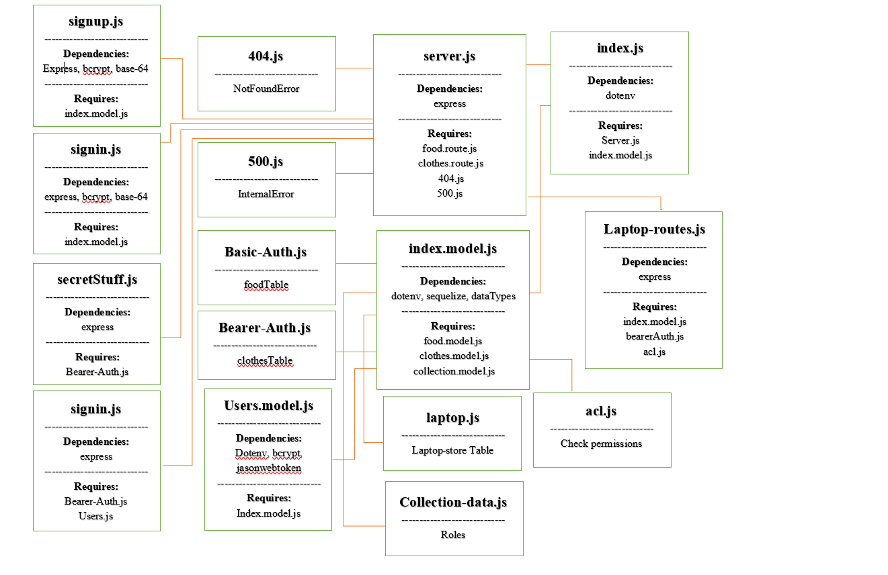

# Laptop-store-Ahmad-Sohaib

## Project: Laptop Store:

group members Ahmad Tayseer and Sohaib Al-momani

## The roles we used:

1. User: read advertisements.
2. Writer : read and create advertisements.
3. Editor: read, create and edit advertisements.
4. Admin: read, create, edit and delete advertisements.

## The routes we created:

1. Sign Up Router (/signup).
2. Sign In Router (/signin).
3. Secret Router (/secret).
4. All User Router (/users).
5. API Router (/:model).

[GitHub Link](https://github.com/Ahmad-Tayseer/Laptop-store-Ahmad-Sohaib)

[Heroku Link](https://laptop-store-ahmad-sohaib.herokuapp.com/)

[GitHub Actions Link](https://github.com/Ahmad-Tayseer/Laptop-store-Ahmad-Sohaib/actions)

